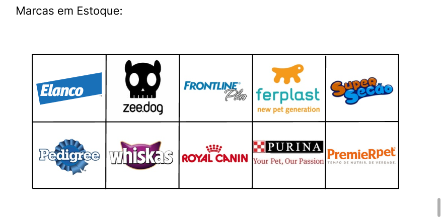

<h1 align="center">Página Home</h1>

### - Nosso `Header` + `Carrossel`:

       
   

### - Nosso `Carrossel de Cards`:

       
   

### - Nossas `Marcas em Estoque`:

       
   

### - Nossa `Localização` + `Rodapé`:

       
   

  

<h1 align="center">Página de Login</h1>

### - Nosso `Formulário`:

       
   

  

<h1 align="center">Página de Cadastro</h1>

### - Nosso `Formulário`:

       
   

  

<h1 align="center">Página de Produtos</h1>

### - Nossa `Página`:

       
   

### - Nosso `Carrinho`:

       
   
