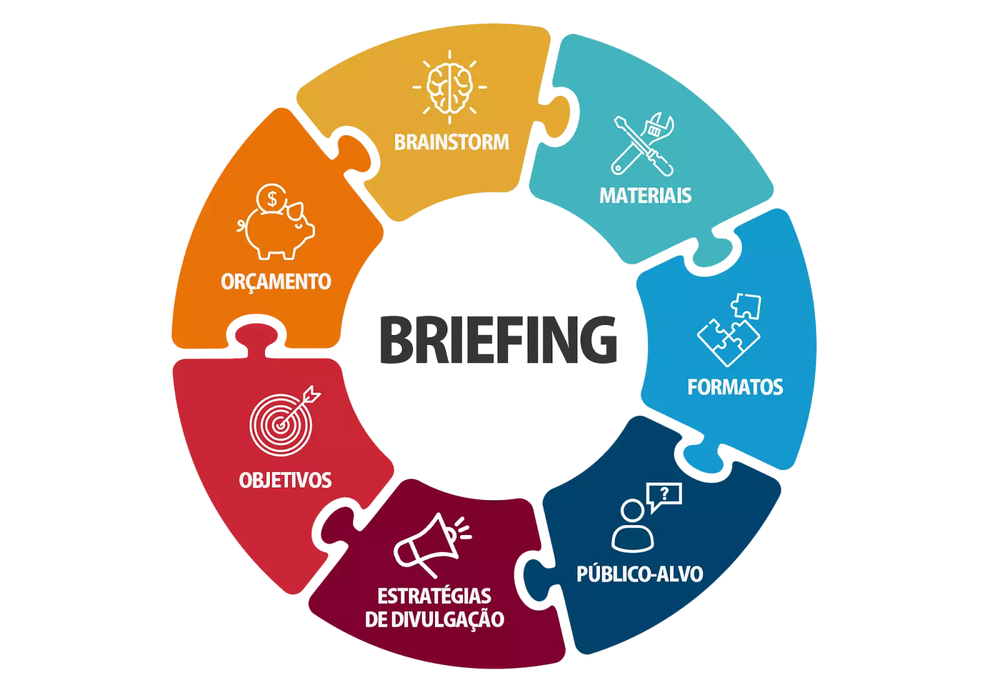

 
 
 

   

   
  
  
  

 
   

   </a>

   ### - Seja bem-vindo(a) à documentação deste projeto. Aqui, você encontrará uma descrição detalhada sobre a `PetPlus`, comparações dos protótipos de nossas páginas com o resultado final delas, imagens e gifs mostrando por completo o site, além de dificuldades que encontramos durante o desenvolvimento e muito mais!

   

   </a>

   ### - Afinal, sobre o que se trata a PetPlus? Basicamente, é um projeto aonde tínhamos por objetivo `desenvolver um site sobre PetShop`, produzindo tanto o frontend (visual do site) quanto o backend (o cérebro do site).

   ### - Começamos este projeto no dia 16 de outubro, precisando entregar o site completo no dia 15 de dezembro, cerca de praticamente dois meses de desenvolvimento.

   ### - O projeto foi feito por 3 integrantes, com os links de seus perfis sendo colocados no final da documentação.

   

   </a>
   

       
   

   ### - O briefing é um `documento que servirá como um guia para a execução de um projeto`. Ele contém uma série de informações como: dados sobre a empresa, o mercado em que ela atua, o público ao qual ela se direciona e os seus objetivos com o projeto.

   ### - Antes de começarmos a produzir qualquer coisa, precisávamos antes definir nossas `metas` e `objetivos` a cada semana, com o intuito de não nos perdermos e termos um pouco de organização. Caso queira ver as metas que definimos a cada semana, [clique aqui](https://github.com/PetPlus-Project/PetPlusAtualizado/blob/main/Docs/briefing.md).

   ### - Como `público alvo`, procuramos atingir as necessidades dos `donos de pets` que procuravam produtos de todos os tipos para os seus animais, desde rações e brinquedos comuns do dia a dia até mesmo produtos especiais para animais que possuem algum tipo de deficiência ou que já é idoso e está com a mobilidade baixa, como por exemplo uma cama ortopédica.

   ### - Nossas `Paletas de Cores`:
   

 

 

 

### - `Fontes` do Nosso Projeto:
#### • Kanit
#### • Inter
#### • Poppins
#### • Roboto

   </a>
     
### - Caso queira ver os protótipos que fizemos no Figma antes de começarmos a de fato desenvolver o site, [clique aqui](https://github.com/PetPlus-Project/PetPlusAtualizado/blob/main/Docs/figma.md).

   

       
   

   </a>
   

      <table>
  <thead>
    <tr>
      <th> Linguagens </th>
      <th> Frameworks </th>
    </tr>
  </thead>
  <tbody>
    <tr>
      <td align="center">   </td>
      <td align="center">  </td>
    </tr>
    <tr>
      <td align="center">  </td>
      <td align="center">  </td>
    </tr>
    <tr>
      <td align="center">  </td>
      <td align="center">  </td>
    </tr>
  </tbody>
</table>
   

   

   </a>
    

      lorem ipsum dolor
   
 
   
   

   

   </a>
    

  <table style="width: 100%">
    <tbody>
      <tr align=center>
        <th><strong> Ramon X. Camargo   RamonCamarg </strong></th>
        <th><strong> Vinícius G. Feitoza   epicestudar </strong></th>
        <th><strong> Rhenan X. Neves   rhenanneves12 </strong></th>
      </tr>
      <tr align=center>
        <td>
          
        </td>
        <td>
          
        </td>
        <td>
          
        </td>
      </tr>
    </tbody>

  </table>

   

   
   

   

   </a>

* ### Site Modelo:
    - [Petz](https://petz.com.br)

* ### IA's Usadas:
    - [ChatGPT 3.5](https://chat.openai.com/)
    - [Bing - Image Creator](https://www.bing.com/images/create)

   
   
